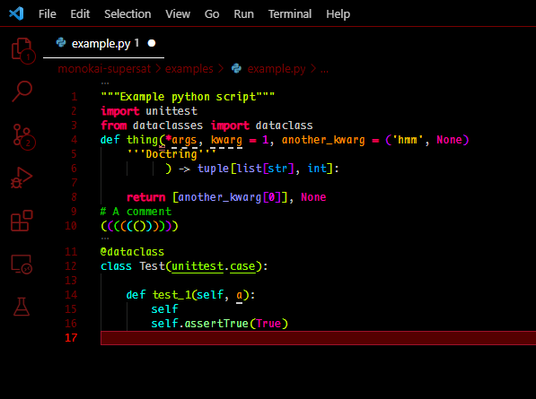

# README

## Overview

- Black background
- Red UI elements
- Extremely saturated colours in syntax highlighting

Based on "Monokai Charcoal high contrast" by 74th.
<https://marketplace.visualstudio.com/items?itemName=74th.monokai-charcoal-high-contrast>
For slightly less "intense" colours I recommend that

## Rationale

For me high contrast not just in terms of total brightness but also between colours makes text easier to read